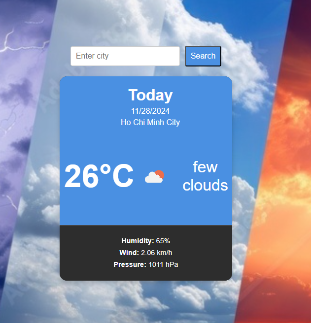

# Weather App 🌤️

A simple weather application built using **React.js** and the **OpenWeatherMap API**. This app allows users to search for a city and view its current weather details, including temperature, weather description, and other relevant data.


---

## Features ✨
- **City Search**: Search for any city to get current weather information.
- **Dynamic Weather Updates**: Displays live weather data fetched from OpenWeatherMap.
- **Temperature with Icon**: Displays the current temperature along with the corresponding weather icon.
- **Weather Details**: Additional details such as humidity, wind speed, and air pressure.
- **Responsive Design**: Clean and modern design, works well across devices.

---

## Technologies Used 🛠️
- **React.js**: For building the user interface.
- **Axios**: For making API requests.
- **CSS**: For styling components.
- **OpenWeatherMap API**: For fetching real-time weather data.

----

## Project Setup 🚀

### Steps to Run
1. Clone the repository:
   ```git clone```
2. Navigate to the project directory:
    ```cd <repo-name>```
3. Install dependencies:
    ```npm install```
4. Start the development server:
    ```npm start```
   
